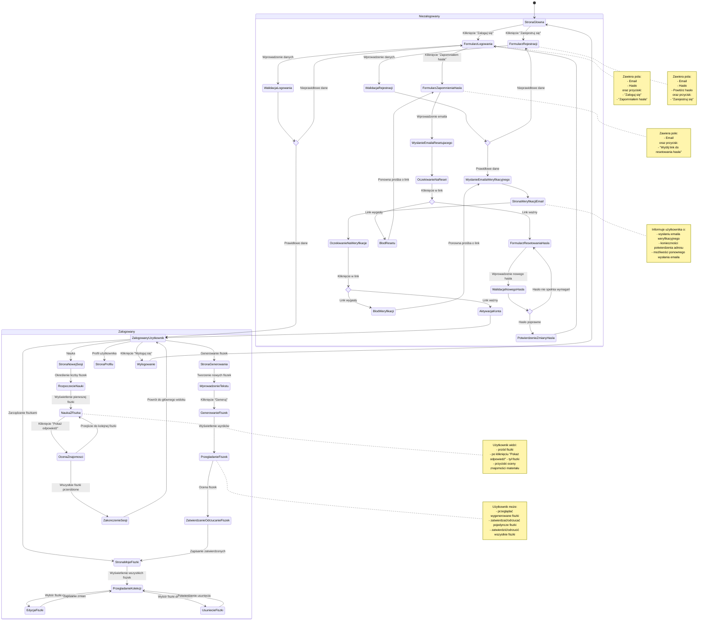

# Diagram Podróży Użytkownika - Moduł Autentykacji

<user_journey_analysis>
## Analiza podróży użytkownika na podstawie dokumentacji

### Ścieżki użytkownika wymienione w dokumentacji
1. **Rejestracja nowego użytkownika (US-001)**:
   - Wprowadzenie adresu email i hasła
   - Weryfikacja poprawności danych
   - Wysłanie emaila weryfikacyjnego
   - Kliknięcie w link weryfikacyjny
   - Aktywacja konta
   - Powiadomienie o pomyślnej rejestracji

2. **Logowanie do systemu (US-002)**:
   - Wprowadzenie emaila i hasła
   - Weryfikacja poprawności danych
   - Zalogowanie i przekierowanie do strony głównej
   - Alternatywnie: wyświetlenie komunikatu błędu

3. **Resetowanie hasła (US-003)**:
   - Żądanie resetowania hasła poprzez podanie emaila
   - Wysłanie emaila z linkiem do resetowania hasła
   - Kliknięcie w link
   - Ustawienie nowego hasła
   - Potwierdzenie zmiany hasła

4. **Dostęp do funkcjonalności aplikacji**:
   - Strony dostępne tylko dla zalogowanych użytkowników
   - Przekierowanie niezalogowanych użytkowników do logowania
   - Wylogowanie i powrót do stanu niezalogowanego

### Główne podróże i ich stany
1. **Podróż rejestracji**:
   - Stan początkowy: Niezalogowany użytkownik
   - Formularz rejestracji
   - Walidacja danych
   - Wysłanie emaila weryfikacyjnego
   - Oczekiwanie na weryfikację
   - Aktywacja konta (po kliknięciu w link)
   - Stan końcowy: Zarejestrowany i zalogowany użytkownik

2. **Podróż logowania**:
   - Stan początkowy: Niezalogowany użytkownik
   - Formularz logowania
   - Walidacja danych
   - Stan końcowy: Zalogowany użytkownik

3. **Podróż resetowania hasła**:
   - Stan początkowy: Niezalogowany użytkownik, zapomniał hasła
   - Formularz zapomnienia hasła
   - Wysłanie emaila z linkiem resetującym
   - Formularz resetowania hasła
   - Walidacja nowego hasła
   - Stan końcowy: Użytkownik z nowym hasłem, możliwość logowania

4. **Podróż wylogowania**:
   - Stan początkowy: Zalogowany użytkownik
   - Akcja wylogowania
   - Stan końcowy: Niezalogowany użytkownik

### Punkty decyzyjne i alternatywne ścieżki
1. **Po rejestracji**:
   - Użytkownik może od razu przejść do logowania
   - Użytkownik może najpierw zweryfikować email

2. **Podczas logowania**:
   - Użytkownik może wprowadzić prawidłowe dane i zalogować się
   - Użytkownik może wprowadzić nieprawidłowe dane i otrzymać komunikat błędu
   - Użytkownik może zapomnieć hasła i przejść do procesu resetowania

3. **Podczas resetowania hasła**:
   - Użytkownik może podać prawidłowy email (istniejący w systemie)
   - Użytkownik może podać nieprawidłowy email (nieistniejący w systemie)
   - Link resetujący może być ważny lub wygasły

### Cel każdego stanu
- **Strona główna**: Umożliwia użytkownikowi zapoznanie się z aplikacją i dostęp do funkcji logowania/rejestracji.
- **Formularz rejestracji**: Zbieranie danych niezbędnych do utworzenia konta.
- **Formularz logowania**: Autentykacja użytkownika w systemie.
- **Formularz zapomnienia hasła**: Inicjacja procesu odzyskiwania hasła.
- **Formularz resetowania hasła**: Umożliwia ustawienie nowego hasła.
- **Strona weryfikacji emaila**: Informuje użytkownika o konieczności weryfikacji i obsługuje proces aktywacji konta.
- **Strona chroniona**: Dostęp do głównych funkcjonalności aplikacji po zalogowaniu.
</user_journey_analysis>

<mermaid_diagram>

</mermaid_diagram> 