# Diagram Architektury UI - Moduł Autentykacji

<architecture_analysis>
## Analiza architektury na podstawie dokumentacji

### Komponenty wymienione w dokumentacji
1. **Strony Astro**:
   - `/login` - Strona logowania
   - `/register` - Strona rejestracji
   - `/forgot-password` - Strona resetowania hasła
   - `/reset-password` - Strona ustawiania nowego hasła
   - `/verify-email` - Strona weryfikacji emaila
   - Strony chronione: `/generate`, `/profile`, `/flashcards`, `/sessions/new`

2. **Layouty Astro**:
   - `Layout.astro` - Uniwersalny layout dla wszystkich stron aplikacji

3. **Komponenty React dla autentykacji**:
   - `LoginForm.tsx` - Formularz logowania
   - `RegisterForm.tsx` - Formularz rejestracji
   - `ForgotPasswordForm.tsx` - Formularz zapomnienia hasła
   - `ResetPasswordForm.tsx` - Formularz resetowania hasła

4. **Inne komponenty**:
   - `NavBar.astro` - Dynamicznie dostosowujący się do stanu autentykacji
   - `Footer.astro` - Stopka strony

5. **Komponenty UI z Shadcn/ui**:
   - `Input` - Pole tekstowe
   - `Button` - Przycisk
   - `Label` - Etykieta
   - `Card` - Karta
   - `Form` - Formularz (z react-hook-form)
   - `Alert` - Komunikaty alertów
   - `Dialog` - Okna dialogowe

6. **Endpointy API**:
   - `/api/auth/register` - Rejestracja użytkownika
   - `/api/auth/login` - Logowanie użytkownika
   - `/api/auth/logout` - Wylogowanie użytkownika
   - `/api/auth/forgot-password` - Inicjacja procesu resetowania hasła
   - `/api/auth/reset-password` - Ustawienie nowego hasła
   - `/api/auth/callback` - Obsługa callbacków autentykacji

7. **Middleware**:
   - `middleware/index.ts` - Kontrola dostępu i zarządzanie sesją

### Główne strony i ich komponenty
- Strona logowania (`/login`) - Zawiera `LoginForm.tsx`
- Strona rejestracji (`/register`) - Zawiera `RegisterForm.tsx`
- Strona zapomnienia hasła (`/forgot-password`) - Zawiera `ForgotPasswordForm.tsx`
- Strona resetowania hasła (`/reset-password`) - Zawiera `ResetPasswordForm.tsx`
- Strona weryfikacji emaila (`/verify-email`) - Zawiera logikę do obsługi tokenów weryfikacyjnych

### Przepływ danych między komponentami
1. Użytkownik wchodzi na stronę logowania/rejestracji.
2. Formularz React zbiera dane wejściowe, waliduje je i wysyła do odpowiedniego endpointu API.
3. Endpoint API komunikuje się z Supabase Auth.
4. Supabase Auth zwraca odpowiedź (sukces/błąd).
5. W przypadku sukcesu, middleware aktualizuje `Astro.locals.user` i zarządza przekierowaniami.
6. NavBar.astro reaguje na zmiany stanu autentykacji i dostosowuje interfejs użytkownika.

### Funkcjonalność komponentów
- `LoginForm.tsx`: Walidacja pól, wysyłanie danych do API, obsługa odpowiedzi i błędów.
- `RegisterForm.tsx`: Walidacja pól, wysyłanie danych do API, obsługa odpowiedzi i błędów, przekierowanie na stronę weryfikacji.
- `ForgotPasswordForm.tsx`: Walidacja adresu email, inicjacja procesu resetowania hasła.
- `ResetPasswordForm.tsx`: Walidacja nowego hasła, obsługa tokenu z URL, aktualizacja hasła.
- `NavBar.astro`: Dynamiczne renderowanie elementów na podstawie stanu autentykacji.
- `middleware/index.ts`: Ochrona ścieżek, zarządzanie sesją, przekierowania.

```mermaid
flowchart TD
    %% Główne grupy
    subgraph "Strony Autentykacji"
        LoginPage["Strona Logowania (/login)"]
        RegisterPage["Strona Rejestracji (/register)"]
        ForgotPasswordPage["Strona Zapomnienia Hasła (/forgot-password)"]
        ResetPasswordPage["Strona Resetowania Hasła (/reset-password)"]
        VerifyEmailPage["Strona Weryfikacji Email (/verify-email)"]
    end

    subgraph "Strony Chronione"
        GeneratePage["Strona Generowania Fiszek (/generate)"]
        FlashcardsPage["Strona Moich Fiszek (/flashcards)"]
        SessionsPage["Strona Nowej Sesji (/sessions/new)"]
        ProfilePage["Strona Profilu (/profile)"]
        AdminPage["Panel Administratora (/admin/metrics)"]
    end

    subgraph "Layouty i Komponenty Wspólne"
        MainLayout["Layout.astro"]
        Navbar["NavBar.astro"]
        Footer["Footer.astro"]
    end

    subgraph "Komponenty Autentykacji"
        LoginForm["LoginForm.tsx"]
        RegisterForm["RegisterForm.tsx"]
        ForgotPasswordForm["ForgotPasswordForm.tsx"]
        ResetPasswordForm["ResetPasswordForm.tsx"]
    end

    subgraph "Komponenty UI (Shadcn/ui)"
        Input["Input.tsx"]
        Button["Button.tsx"]
        Label["Label.tsx"]
        Card["Card.tsx"]
        Form["Form.tsx"]
        Alert["Alert.tsx"]
        Dialog["Dialog.tsx"]
    end

    subgraph "Endpointy API"
        RegisterAPI["/api/auth/register"]
        LoginAPI["/api/auth/login"]
        LogoutAPI["/api/auth/logout"]
        ForgotPasswordAPI["/api/auth/forgot-password"]
        ResetPasswordAPI["/api/auth/reset-password"]
        CallbackAPI["/api/auth/callback"]
    end

    subgraph "Middleware i Zarządzanie Sesją"
        AuthMiddleware["middleware/index.ts"]
        SupabaseAuth["Supabase Auth"]
        SupabaseClient["createServerClient"]
    end

    %% Relacje między komponentami
    
    %% Strony używają layoutu
    LoginPage -->|używa| MainLayout
    RegisterPage -->|używa| MainLayout
    ForgotPasswordPage -->|używa| MainLayout
    ResetPasswordPage -->|używa| MainLayout
    VerifyEmailPage -->|używa| MainLayout
    GeneratePage -->|używa| MainLayout
    FlashcardsPage -->|używa| MainLayout
    SessionsPage -->|używa| MainLayout
    ProfilePage -->|używa| MainLayout
    AdminPage -->|używa| MainLayout
    
    %% Layout zawiera komponenty
    MainLayout -->|zawiera| Navbar
    MainLayout -->|zawiera| Footer
    
    %% Strony autentykacji używają komponentów formularzy
    LoginPage -->|używa| LoginForm
    RegisterPage -->|używa| RegisterForm
    ForgotPasswordPage -->|używa| ForgotPasswordForm
    ResetPasswordPage -->|używa| ResetPasswordForm
    
    %% Komponenty autentykacji używają komponentów UI
    LoginForm -->|używa| Input
    LoginForm -->|używa| Button
    LoginForm -->|używa| Label
    LoginForm -->|używa| Card
    LoginForm -->|używa| Form
    LoginForm -->|używa| Alert
    
    RegisterForm -->|używa| Input
    RegisterForm -->|używa| Button
    RegisterForm -->|używa| Label
    RegisterForm -->|używa| Card
    RegisterForm -->|używa| Form
    RegisterForm -->|używa| Alert
    
    ForgotPasswordForm -->|używa| Input
    ForgotPasswordForm -->|używa| Button
    ForgotPasswordForm -->|używa| Label
    ForgotPasswordForm -->|używa| Card
    ForgotPasswordForm -->|używa| Form
    ForgotPasswordForm -->|używa| Alert
    
    ResetPasswordForm -->|używa| Input
    ResetPasswordForm -->|używa| Button
    ResetPasswordForm -->|używa| Label
    ResetPasswordForm -->|używa| Card
    ResetPasswordForm -->|używa| Form
    ResetPasswordForm -->|używa| Alert
    
    %% Przepływ danych przez API
    LoginForm -->|wywołuje| LoginAPI
    RegisterForm -->|wywołuje| RegisterAPI
    ForgotPasswordForm -->|wywołuje| ForgotPasswordAPI
    ResetPasswordForm -->|wywołuje| ResetPasswordAPI
    Navbar -->|wywołuje| LogoutAPI
    
    %% Middleware i ochrona ścieżek
    AuthMiddleware -->|chroni| GeneratePage
    AuthMiddleware -->|chroni| FlashcardsPage
    AuthMiddleware -->|chroni| SessionsPage
    AuthMiddleware -->|chroni| ProfilePage
    AuthMiddleware -->|chroni| AdminPage
    
    %% Supabase Auth
    RegisterAPI -->|używa| SupabaseAuth
    LoginAPI -->|używa| SupabaseAuth
    LogoutAPI -->|używa| SupabaseAuth
    ForgotPasswordAPI -->|używa| SupabaseAuth
    ResetPasswordAPI -->|używa| SupabaseAuth
    CallbackAPI -->|używa| SupabaseAuth
    
    AuthMiddleware -->|używa| SupabaseClient
    SupabaseClient -->|komunikuje się z| SupabaseAuth
    
    %% Navbar reaguje na zmiany stanu autentykacji
    SupabaseAuth -->|aktualizuje stan| Navbar
    
    %% Klasyfikacja komponentów
    classDef newComponents fill:#C9E4CA,stroke:#087f5b
    classDef existingComponents fill:#e1effe,stroke:#3182ce
    classDef apiEndpoints fill:#fed7e2,stroke:#d53f8c
    classDef authComponents fill:#ffe8cc,stroke:#dd6b20
    
    class LoginForm,RegisterForm,ForgotPasswordForm,ResetPasswordForm newComponents
    class Navbar,Footer,MainLayout existingComponents
    class RegisterAPI,LoginAPI,LogoutAPI,ForgotPasswordAPI,ResetPasswordAPI,CallbackAPI apiEndpoints
    class AuthMiddleware,SupabaseAuth,SupabaseClient authComponents
```

</architecture_analysis>

<mermaid_diagram>

</mermaid_diagram> 